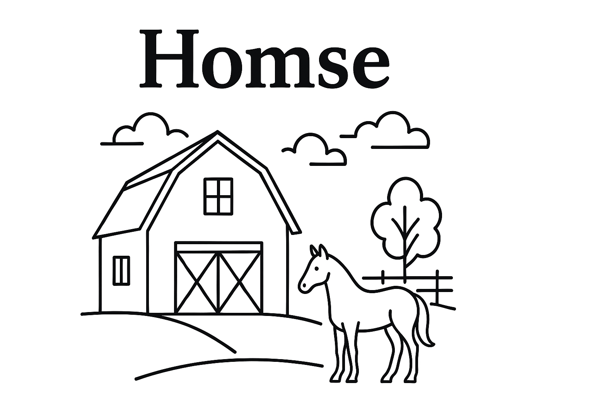

# BookingHomse

## Overview

BookingHomse is a comprehensive booking, reminder, and appointment management software designed specifically for equine facilities. Built with Laravel, Vue.js, and Inertia.js, it streamlines the process of scheduling riding sessions, managing horse availability, and coordinating group activities.

Whether you're running a riding school, boarding stable, or equestrian center, BookingHomse helps you keep your horses healthy, your schedule organized, and your riders informed.

## Features

### Current & Upcoming

- **🐴 Horse Cooldown Management** - Give your horses the rest they deserve. Automatically track and enforce cooldown periods after riding sessions to ensure horse welfare and prevent overwork.

- **📱 SMS & Email Reminders** - Never miss an appointment again. Automated notifications keep riders informed about upcoming bookings and any schedule changes.

- **👥 Group Ride Capabilities** - Book multiple horses for group outings with friends and family. Group bookings can be configured to require management approval for better control.

- **📊 Management Dashboard** - Comprehensive administrative interface to oversee all upcoming and requested appointments at a glance. Accept, decline, or reschedule bookings with ease.

- **⚙️ Flexible Approval System** - Configure auto-acceptance for routine bookings or require manual approval for complex scenarios like group rides or specific horses.

- **🔔 Smart Notifications** - Keep everyone in the loop with real-time updates on booking status, approvals, and schedule changes.

## Technology Stack

- **Backend**: Laravel
- **Frontend**: Vue.js with Inertia.js
- **Architecture**: Modern SPA experience with server-side routing
